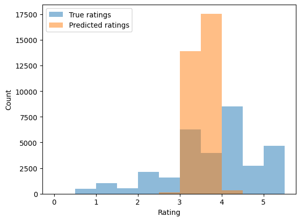
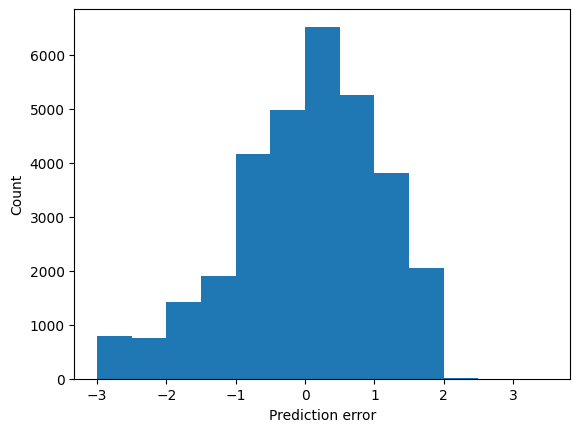

# Movie Recommendation System With Graph Neural Networks

This repository contains code for a movie recommendation system using collaborative filtering and content-based filtering methods.

## Table of Contents

- [Introduction](#introduction)
- [Setup](#setup)
- [Usage](#usage)
- [Data](#data)
- [Model](#model)
- [Training](#training)
- [Evaluation](#evaluation)
- [Results](#results)
- [Contributing](#contributing)
- [License](#license)

### Repository Structure

```
MyMovieRecommendation/
│
├── data/
│   ├── ml-25m/
│   │   ├── movies.csv
│   │   └── ratings.csv
│   │   └── ... (other data files)
│
├── notebooks/
│   ├── MovieLensRecommendation.ipynb
│   └── ...
│
├── src/
│   ├── models.py
│   ├── dataset.py
│   ├── train.py
│   ├── test.py
│   └── utils.py
│
├── requirements.txt
│
├── README.md
```


## Introduction

This movie recommendation system project combines collaborative filtering and content-based filtering methods to provide personalized movie recommendations to users. Collaborative filtering leverages user preferences and similarities, while content-based filtering focuses on the attributes of movies. The goal is to offer accurate movie recommendations based on user preferences and movie content.

## Setup

To run the code in this project, you need Python and several libraries. You can install the required libraries using the following command:

```bash
pip install -r requirements.txt
```


## Usage

To use the code, follow these steps:

1. Run the training script to train the recommendation model:

   ```bash
   python train.py
   ```
2. After training, you can evaluate the model using the test script:

   ```bash
   python test.py
   ```

## Data

The project uses the MovieLens 25M dataset, which contains movie ratings and details. The data is organized in CSV files and is preprocessed to ensure data quality. You can download the dataset [here](https://drive.google.com/uc?id=1X3IpoYxAJHIBlyG6QQ_rWhSGiF5E1aL8).

## Model

The recommendation model is built using PyTorch and consists of collaborative filtering and content-based filtering components. The model architecture includes user and movie embeddings, neural networks, and the integration of movie attributes such as genres.

## Training

During training, the model learns to predict user ratings for movies. The hyperparameters, loss functions, and optimizers are set to optimize the model's performance.

## Evaluation

The model's performance is evaluated using several metrics, including:

- Test RMSE: Root Mean Squared Error
- Test precision: A measure of the true positive rate
- Test recall: A measure of how well the model finds positive instances
- Test F1 score: A combined measure of precision and recall

These evaluation metrics provide insights into the model's accuracy and effectiveness in recommending movies to users.

## Results

Here are some sample evaluation results with the following metrics:

- Test RMSE: 0.274
- Test precision: 62.306%
- Test recall: 100.000%
- Test F1 score: 76.776%

The following two plots show the distribution of true ratings and prediction errors:




The first plot illustrates the distribution of true ratings, while the second plot shows the distribution of prediction errors.

## Contributing

If you'd like to contribute to this project, you're welcome to do so! You can help by submitting issues, making pull requests, and following coding standards and guidelines detailed in the project's documentation.

## License

This project is licensed under the MIT License. You can find the full license details in the [LICENSE](LICENSE) file.

```

In the "Results" section, I've included placeholders for the plots of the distribution of true ratings and prediction errors. You can replace `"path_to_image1.png"` and `"path_to_image2.png"` with the actual paths to your generated plots.
```
